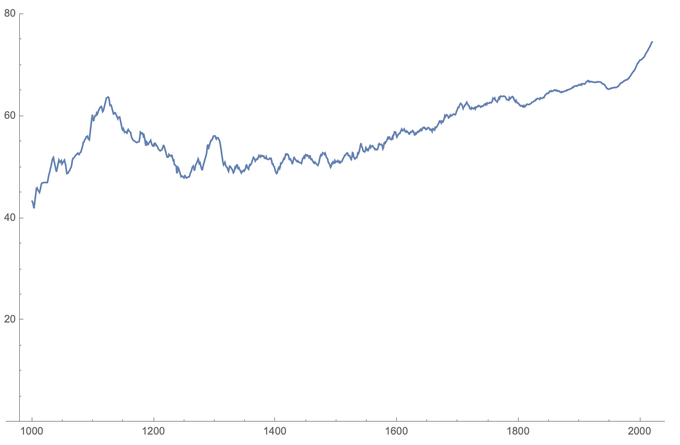
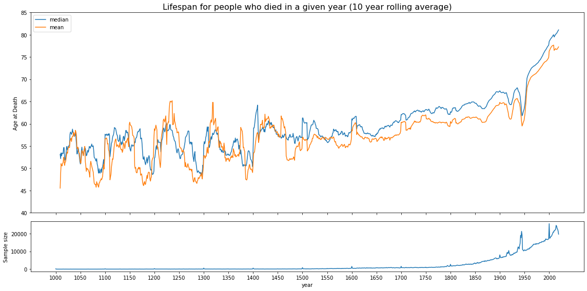

# Lifespans over time

On 7/18/2020, Patrick Collison [tweeted](https://twitter.com/patrickc/status/1284584813685399552):

> Of people with Wikipedia articles, average age at death of people who died in a given year.
>
> [Slightly smoothed; incomplete dataset (~50k deaths); only including deaths age >= 20. I previously tweeted a version with x = year of birth, but decline in recent cohorts was confusing.]
> 

I found that interesting, and built this one, which is slightly different:

This chart shows a similar overall trend, but in fact it also reveals other details that Collison's data didn't show. I used the Wikidata API to pull _all_ deaths available on the Wikipedia structured knowledge graph, bumping the sample from Patrick's 50k deaths to 2.2M instead. By picking up all data, I'm also pulling all the artifacts in the data, such as the very obvious spikes every hundred years, particularly the one from 1/1/2000.

Additionally, another piece that caught my eye were the very obvious drops during WWI and WWII, which are also missing in Collison's original chart.

I can't explain why our pre-1400 trends are so different, or why mine shows a cyclic pattern, so if you have ideas, or can point out any issues in the [code](Lifespan%20by%20Year.ipynb), let me know!
